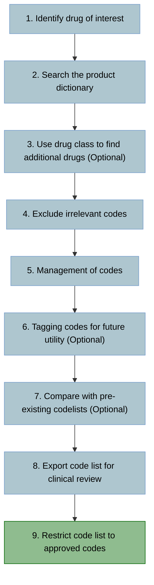

[](https://doi.org/10.1101/2023.04.14.23287661)

# How to: create drug codelists for recorded prescriptions

This is an adaptation of [our work to create SNOMED-CT codelists](https://github.com/NHLI-Respiratory-Epi/SNOMED-CT-codelists/tree/main) which contains considerations specific to generating codelists for drugs or medical devices, instead of for symptoms and conditions.



### Step 1: Identify search terms
- To begin, identify all generic and brand names related to your drug(s) or medical device(s) of interest (synonyms of drug names).
    - Make sure to include all regional variations or ensure that identified names are appropriate for the target region.
        - For example, include both adrenaline and epinephrine.
    - We recommend the following resources as they provide a hierarchical classification to identify all required drug classes and names (use the most appropriate for your dataset):
        - [British National Formulary (BNF)](https://openprescribing.net/bnf/)
        - World Health Organization Collaborating Centre for Drug Statistics Methodology (WHOCC) [Anatomical Therapeutic Chemical (ATC) Classification System](https://www.whocc.no/atc_ddd_index/) 
    - Clinician and/or pharmacist input is essential to identify all relevant terms. 
- Next create "search terms" to find each of the synonymous terms.
    - Grouping together synonyms for each drug into individual lists of search terms will make identification of relevant codes easier. See [highlighted lines in our example *Stata* do file][insert link]
        ```stata
	    //2.5.1 Vasodilator antihypertensive drugs
	    local ambrisentan_list " "ambrisentan" "volibris" "
	    local bosentan_list " "bosentan" "stayveer" "tracleer" "
	    local diazoxide_list " "diazoxide" "proglycem" "eudemine" "
	    local hydralazine_list " "hydralazine" "apresoline" "
	    local iloprost_list " "iloprost" "ilomedin" "ventavis" "
	    local macitentan_list " "macitentan" "opsumit" "
	    local minoxidil_list " "minoxidil" "loniten" "
	    local riociguat_list " "riociguat" "adempas" "
	    local sildenafil_list " "sildenafil" "granpidam" "revatio" "
	    local sitaxentan_list " "sitaxentan" "
	    local tadalafil_list " "tadalafil" "adcirca" "
	    local vericiguat_list " "vericiguat" "verquvo" "
        ```
    - Within a drug class, we recommend nesting search terms to provide a convenient way of tagging all drug codes within a class. See our example *Stata* do file where [insert line] nesting the grouped terms highlighted above:
        ```stata
        local vasodil20501 " "ambrisentan_list" "bosentan_list" "diazoxide_list" "hydralazine_list" "iloprost_list" "macitentan_list" "minoxidil_list" "riociguat_list" "sildenafil_list" "sitaxentan_list" "tadalafil_list" "vericiguat_list" "
        ```
    - Limit search terms to just the drug chemical of interest, and exclude common suffixes such as:
        - *-nitrate*
     	- *-arginine*
        - *-hydrochloride*
        - *-mesilate*

### Step 2: Search the product dictionary using the search terms
- Import the product dictionary that includes the drugs contained within the electronic healthcare record (EHR) database that you are creating your codelist for.
- Search the dictionary for each of your search terms defined in [Step 1](#step-1-identify-search-terms), ensuring that both the search and dictionary terms are passed through a `lower()` function to avoid missing matches due to differing case.
    - Search within each variable that contains information about the drug name. In the [Clinical Practice Research Datalink (CPRD) Aurum](https://cprd.com/primary-care-data-public-health-research) this is the *term*, *productname*, and *drugsubstancename* variables.
- Once you have searched the dictionary for all your terms, keep only the terms that matched with at least 1 of your search terms.
	
### Step 3: [OPTIONAL] Use drug class to find additional drugs
- If the EHR database you are using has BNF or ATC codes, you can utilise the drug class hierarchy of these codes to find additional desired drugs that may have been omitted from the search terms.
- In order to search these codes, they must be imported in string format in [Step 2](#step-2-search-the-product-dictionary-using-the-search-terms).
    - If working with CPRD Aurum, which includes BNF codes, note that drugs existing in multiple locations within the formulary hierarchy have multiple BNF codes separated by a slash and a space `/ `. This will require a search to match codes in 2 possible formats. For example, to search for BNF chapter 2.5 using *Stata*:
        ```stata
        replace match = 1 if strmatch(bnfchapter, "205*")  | strmatch(bnfchapter, "*/ 205*") 
        ```
- If you find additional desired drugs, these can be added to the search terms in [Step 1](#step-1-identify-search-terms), and [Step 2](#step-2-search-the-product-dictionary-using-the-search-terms) and [Step 3](#step-3-optional-use-drug-class-to-find-additional-drugs) can be run again. This process can be repeated until all desired drugs are included.

### Step 4: Exclude inappropriate codes
- There is a good chance that your search terms will identify terms that are not relevant for your intended use of the codelist.
- Further searches using *exclusion* terms can be performed to highlight drugs for removal based on name, route of administration, or formulation (where these data are provided).
- Before removing any terms highlighted for exclusion, make sure any desired terms are not erroneously highlighted.
- Once all the codes that can be removed in an automated fashion have been removed, it is important to complete a final manual screen of your codelist and manually remove any undesired codes using their product identifier.

### Step 5: Cleaning 
- There step is for "cleaning" the data
- First, there's a good chance some of your codes are "overlapping" across value sets if they are combination-recipe drugs, in which case you will need to resort the codes to make these value sets separate
- Second, you may need to categorize drugs into required drug groups, perhaps because of computational considerations (e.g., *Stata* has macro character limits) you weren't able to do this initially

### Step 6: [OPTIONAL] Tagging for utility 
- In come cases, there may be combination-recipe drugs that could correspond to a different ontological section (i.e., a different codelist)
- We tag these drugs to help facilitate the codelist’s broader utility (e.g., excluding for future analyses or study contexts)
- This helps facilitate the codelist’s broader utility and adaptability
- For example, *hydrochlorothiazide/captopril* is a single drug we would tag - it includes both *diuretic* and *Renin-angiotensin-aldosterone system* (RAAS) chemical components (BNF Ch. 2.2 for diuretics and Ch. 2.5 for RAAS respectively)        

### Step 7: [OPTIONAL] Compare with pre-existing codelists    
- Version history = compare current vs. previous versions
- Mapping = map codes labelled under different ontologies (e.g., ATC-BNF mapping, ATC-VA_Class mapping).    
    - For CPRD Aurum, use [NHS Digital's TRUD site](https://isd.digital.nhs.uk/trud/users/guest/filters/0/categories/6/items/24/releases)    

**Now we have the “raw” codelist (not study-specific; ready for adaptation to a cohort through clinical review)**     

### Step 8: Export codelist for review by a clinician
- Export codelist as an Excel spreadsheet.
- Ask clinician(s) to review codelist and check codes are appropriate to identify prescription events of interest in your desired study.
- Ask the reviewing clinican to generate a column at the end of the spreadsheet headed with their initials where they label the list of terms for inclusion or exclusion using the following definitions:
<div align="center">

| Label | Definition                           |
| :---: | :----------------------------------- |
| 0     | No - clear exclusion                 |
| 1     | Yes - clear inclusion                |
| 2     | Maybe - use for sensitivity analyses |
</div>

- Use multiple clinicians for studies with multimorbidity (e.g., pulmonologist, cardiologist, nephrologist, etc.)    

### Step 9: Restrict your codelist to codes approved by clinician(s) and save.
- Remove any codes from the codelist that were marked with a 0 by the reviewing clinican in [Step 7](#step-7-export-codelist-for-review-by-a-clinician).
- Save your finished codelist and export it.
- Your codelist is now ready to use in your study!
- Codelists produced *en route* to your final codelist (e.g. the codelists labelled by clinicians) may come in useful for sensitivity analyses or future studies so do not discard them!

## Example *Stata* code

This code is an example to create a codelist for Chapter 2.5 of the BNF ontology (i.e., [drugs indicated for hypertension and heart failure](https://openprescribing.net/bnf/0205/) )  

```stata

*******************************************************************************
*1) Define drug class(es) of interest - collate list of terms for value sets
*******************************************************************************/
```

- here's our example spreadsheet for [Step 1](images/Step1_github.png) 

```stata
*******************************************************************************
*2) Searching CPRD Aurum Product Browser
*******************************************************************************/

*NB You shouldn't need to change any code within loops, apart from local-macro names, e.g., searchterm, exclude_route, exclude_term, etc.

clear all
macro drop _all
set more off 

//Enter directory to save files in
cd "Z:\Group_work\Emily\Product_browsing_study_data\Codelists\Do-files_publication\"
pwd 

local filename "publication_0205HTNandHF_prodbrowsing"

capture log close
log using `filename', text replace

//Directory of product dictionary
local browser_dir "Z:\Database guidelines and info\CPRD\CPRD_CodeBrowser_202202_Aurum"

//Import latest product browser 
import delimited "`browser_dir'/CPRDAurumProduct.txt", stringcols(1 2) 
	*FORCE 'prodcode' and 'dmdcode' to be string variable, or will lose data

//no EMIS lookupfile required (unlike medical code browsing)


	
******
// Chemical + proprietary name searchterms
******
	*Insert your search terms into each local as shown below, change local names according to chemical name, then group chemical macros into bnfsubsection macro


*2.5.1 Vasodilator antihypertensive drugs
local ambrisentan_list " "ambrisentan" "volibris" "
local bosentan_list " "bosentan" "stayveer" "tracleer" "
local diazoxide_list " "diazoxide" "proglycem" "eudemine" "
local hydralazine_list " "hydralazine" "apresoline" "
local iloprost_list " "iloprost" "ilomedin" "ventavis" "
local macitentan_list " "macitentan" "opsumit" "
local minoxidil_list " "minoxidil" "loniten" "
local riociguat_list " "riociguat" "adempas" "
local sildenafil_list " "sildenafil" "granpidam" "revatio" "
local sitaxentan_list " "sitaxentan" "
local tadalafil_list " "tadalafil" "adcirca" "
local vericiguat_list " "vericiguat" "verquvo" "

local vasodil20501 " "ambrisentan_list" "bosentan_list" "diazoxide_list" "hydralazine_list" "iloprost_list" "macitentan_list" "minoxidil_list" "riociguat_list" "sildenafil_list" "sitaxentan_list" "tadalafil_list" "vericiguat_list" "

	
*2.5.2 Centrally-acting antihypertensive drugs
local clonidine_list " "clonidine"  "catapres" "
local guanfacine_list " "guanfacine" "tenex" "
local methyldopa_list " "methyldopa" "aldomet" "
local moxonidine_list " "moxonidine" "physiotens" "

local centact20502 " "clonidine_list" "guanfacine_list" "methyldopa_list" "moxonidine_list" "
	
*2.5.3 Adrenergic neurone blocking drugs	
local guanethidine_monosulfate_list " "guanethidine"  "ismelin" "

local adrblocker20503 " "guanethidine_monosulfate_list" "


*2.5.4: Alpha-adrenoceptor blocking drugs
local doxazosin_mesilate_list " "doxazosin"  "cardura" "doxadura" "larbex" "raporsin" "slocinx" "
local indoramin_list " "indoramin" "baratol" "doralese" "
local phenoxybenzamine_list " "phenoxybenzamine" "dibenyline" "
local phentolamine_mesilate_list " "phentolamine" "rogitine" "
local prazosin_list " "prazosin" "hypovase" "minipress"  "
local terazosin_list " "terazosin" "benph" "hytrin" "

local ablocker20504 " "doxazosin_mesilate_list" "indoramin_list" "phenoxybenzamine_list" "phentolamine_mesilate_list" "prazosin_list" "terazosin_list" "

*2.5.5: RAAS - no overlap 
local aliskiren_list " "aliskiren"  "rasilez" "
local azilsartan_medoxomil_list " "azilsartan" "edarbi" "
local candesartan_cilexetil_list " "candesartan" "amias" "
local cilazapril_list " "cilazapril" "vascace" "
local eprosartan_list " "eprosartan" "teveten" "
local fosinopril_list " "fosinopril" "
local imidapril_list " "imidapril" "tanatril" "
local moexipril_list " "moexipril" "perdix" "
*2.5.5: RAAS - overlap - diuretics, CCB
local captopril_list " "captopril" "kaplon" "ecopace" "noyada" "zidocapt" "capozide" "acezide" "capoten" "tensopril" "acepril" " // co-zidocapt - don't use dash
local enalapril_list " "enalapril" "innovace" "pralenal" "innozide" "
local irbesartan_list " "irbesartan" "aprovel" "ifirmasta" "coaprovel" "
local lisinopril_list " "lisinopril" "lisicostad" "carace" "zestril" "lisopress" "zestoretic" "
local losartan_list " "losartan" "cozaar" "
local olmesartan_medoxomil_list " "olmesartan" "olmetec" "sevikar" "

local perindopril_list " "perindopril" "coversyl" "
local quinapril_list " "quinapril" "accupro" "quinil" "accuretic" "
local ramipril_list " "ramipril"  "tritace" "lopace" "triapin" "
local telmisartan_list " "telmisartan"  "micardis" "tolura" "tolucombi" "
local trandolapril_list " "trandolapril" "gopten" "odrik" "tarka" "
local valsartan_list " "valsartan" "diovan" "entresto" "

local RAASnooverlap20505 " "aliskiren_list" "azilsartan_medoxomil_list" "candesartan_cilexetil_list" "cilazapril_list" "eprosartan_list" "fosinopril_list" "imidapril_list" "moexipril_list" "

local RAAS1overlap20505 " "captopril_list" "enalapril_list" "irbesartan_list" "lisinopril_list" "losartan_list" "olmesartan_medoxomil_list" "

local RAAS2overlap20505 " "perindopril_list" "quinapril_list" "ramipril_list" "telmisartan_list" "trandolapril_list" "valsartan_list" "

	*need to break up into multiple macros
	*if Stata is used, for primary subsections that exceed the programming software's character limit for information contained within nested macros, subsections may need to be temporarily split (e.g., 2.5.5 drugs for Renin-angiotensin system).  

*2.5.8 Other adrenergic neurone blocking drugs 
local ketanserin_list " "ketanserin" "ketensin" "

local othadrblocker20508 " "ketanserin_list" "


*check macro data successfully stored
	display `vasodil20501'
	display `centact20502'
	display `adrblocker20503'
	display `ablocker20504'
	display `RAASnooverlap20505'
	display `RAAS1overlap20505'
	display `RAAS2overlap20505'
	display `othadrblocker20508'

	
*Search all search terms in descriptions

foreach searchterm in ///
"vasodil20501" "centact20502" "adrblocker20503" "ablocker20504" "RAASnooverlap20505" "RAAS1overlap20505" "RAAS2overlap20505" "othadrblocker20508" { 
	
    display "Making a column called `searchterm'"
	generate byte `searchterm' = 0
	
	foreach chemterm in ``searchterm'' {
	
		display "Checking individual search terms in: `chemterm'"
		
		foreach indiv in ``chemterm'' {
		
			display "Searching all columns for *`indiv'*"
		
			foreach codeterm in lower(term) lower(productname) lower(drugsubstancename) {
			
				display "`searchterm': Checking `codeterm' column for *`indiv'*"
				replace `searchterm' = 1 if strmatch(`codeterm', lower("*`indiv'*"))
			}
		}
	}
}


*******************************************************************************
// *3) Use drug class/ontology to find additional drugs 
*******************************************************************************/

*helps pick up outstanding brand or chem names
*can't include in above - nested macros don't like astricks (***)

generate byte 	step3_bnfsearch205=.
replace 		step3_bnfsearch205=1 if 	strmatch(bnfchapter,"205*")  | ///
							strmatch(bnfchapter,"*/ 205*")  

*keep found terms for (Step 2) and (Step 3)
generate byte step2_chem_brand_term = .
replace step2_chem_brand_term=1 if vasodil20501==1 | centact20502==1 | adrblocker20503==1 | ablocker20504==1 | RAASnooverlap20505==1 | RAAS1overlap20505==1 | RAAS2overlap20505==1 | othadrblocker20508==1

count if step2_chem_brand_term == 1 	// 617 from (2a,i)
count if step3_bnfsearch205	 == 1		// 281 from (2a,ii)

keep if step2_chem_brand_term == 1 | step3_bnfsearch205==1  // 627 from (2a i and ii together)

compress
count // 627 total  (Step 2 and 3 together)
browse


******
// Did BNF search pick up *outstanding / additional* codes(proprietary or chemical names) not initially searched on ?
******

generate byte 	step3_BNFoutstanding=.
replace 		step3_BNFoutstanding=1 if step2_chem_brand_term!=1 & step3_bnfsearch205==1
label define lab1 1 "outstanding from 2aii BNFsearch"
label values 	step3_BNFoutstanding lab1 

codebook 	step3_BNFoutstanding
list 	if step3_BNFoutstanding==1
browse 	if step3_BNFoutstanding==1  
count 	if step3_BNFoutstanding==1   // 10 outstanding codes 
	*10 not part of initial value sets = 9 Selexipag & 1 Na-Nitroprusside. Rare? Not commonly prescribed? wait for clinician review.

compress
count // 627 
*if pick up new brand names, return to start of step 1 and add in outstanding brand names for the iteration/rerun of code
*then run up to here again
*may not have any/very few step3_BNFoutstanding=1 if your search is sensitive/broad enough and you went thru iterations of adding outstanding search terms

*here, of the step3_BNFoutstanding=1, few drug issues...new drug? (if all clearly not part of value set, exclude. Otherwise wait for clinician.)


*change 0 in chem_brand_term to . - easier to visualise which codes picked up
replace vasodil20501=. if vasodil20501==0
replace centact20502=. if centact20502==0
replace adrblocker20503=. if adrblocker20503==0
replace ablocker20504=. if ablocker20504==0
replace RAASnooverlap20505=. if RAASnooverlap20505==0
replace RAAS1overlap20505=. if RAAS1overlap20505==0
replace RAAS2overlap20505=. if RAAS2overlap20505==0
replace othadrblocker20508=. if othadrblocker20508==0

sort vasodil20501 centact20502 adrblocker20503 ablocker20504 RAASnooverlap20505 RAAS1overlap20505 RAAS2overlap20505 othadrblocker20508 termfromemis 

*************************************************************
//4.) Exclusions - Remove any irrelevant codes
*************************************************************

*exclude by BNF outstanding codes? - N/A
	*only if all not part of chemical value set. (this may not be indicated in all codelists)
	*here N/A keep for clinician review
	
*exclude ROUTE 
preserve
keep route
duplicates drop
list route
restore

local exclude_route " "*ocular*" "*intracavernous*" "*cutaneous*" " 

//search for route-codes to exclude
foreach excludeterm in exclude_route {

	generate byte `excludeterm' = .

	foreach codeterm in lower(route) {
		
		foreach searchterm in ``excludeterm'' {		
			
			replace `excludeterm' = 1 if strmatch(`codeterm', "`searchterm'")
		}
	}
}

list term prodcodeid drugsubstancename route if exclude_route == 1	
		count if exclude_route == 1 

		drop if exclude_route == 1 // 20 deleted based on route
		drop exclude_route 

		count // 607 new total
		compress

		browse
		sort termfromemis 
		
*exclude TERM, DRUGSUBSTANCENAME 
		*although previously excluded on 'ocular' route, route has missing data for what we want to exclude, so also exclude based on term 'eye'
local exclude_term_drugsub " "*eye*" "*gluten*" " 

//search for route-codes to exclude
foreach excludeterm in exclude_term_drugsub {

	generate byte `excludeterm' = .

	foreach codeterm in lower(term) lower(drugsubstancename) {
		
		foreach searchterm in ``excludeterm'' {		
			
			replace `excludeterm' = 1 if strmatch(`codeterm', "`searchterm'")
		}
	}
}

list term prodcodeid drugsubstancename route if exclude_term_drugsub == 1
count if exclude_term_drugsub == 1 

drop if exclude_term_drugsub == 1 // 6 deleted based on term & drugsubstancename
drop exclude_term_drugsub 

count // 601 new total
compress

browse
sort termfromemis 

/*exclude PRODCODEID / template - but not a transparent method
local exclude_prodcodeid "XXXXXXXX"

//search for prodcodeid-codes to exclude
foreach excludeterm in exclude_prodcodeid {

	generate byte `excludeterm' = .

	foreach codeterm in lower(prodcodeid) {
		
		foreach searchterm in ``excludeterm'' {		
			
			replace `excludeterm' = 1 if strmatch(`codeterm', "`searchterm'")
		}
	}
}

list term prodcodeid if exclude_prodcodeid == 1
count if exclude_prodcodeid == 1

drop if exclude_prodcodeid == 1
drop exclude_prodcodeid

count 
compress

browse
sort termfromemis
*/

*exclude by FORMULATION - N/A

*exclude by BNFCHAPTER - not recommended since very incomplete data


*************************************************************
//5.) Cleaning / resorting
*************************************************************

******
//Flag the codes overlapping in multiple BNF subsections -that should NOT be + make separate/mutually exclusive
******
*this may be more common for chapters with subsections that may have overlap in resulting found terms, if your search is specific/broad enough (e.g., in Ch. 2.2 Diuretics, searching just on "furosemide" would lead to found terms in the 2.2.2 and 2.2.4 and 2.2.8 value sets )


generate flag_overlap=.
egen rowtotal = rowtotal(vasodil20501 centact20502 adrblocker20503 ablocker20504 RAASnooverlap20505 RAAS1overlap20505 RAAS2overlap20505 othadrblocker20508)
replace flag_overlap=1 if rowtotal>1
drop rowtotal

sort flag_overlap drugsubstancename termfromemis
count if flag_overlap==1 // none (0)
*count if flag_overlap==1 & drugsubstancename!=""
*br if flag_overlap==1 

compress
count // 601
browse

*make not mutually exclusive - resort based on missing & complete data on drug substance name
	*N/A for this codelist
	
******		
// More clearning / Modify value sets, as necessary
******

generate byte RAAS20505=.
replace RAAS20505=1 if RAASnooverlap20505==1
replace RAAS20505=1 if RAAS1overlap20505==1
replace RAAS20505=1 if RAAS2overlap20505==1

replace RAAS20505=0 if RAASnooverlap20505==0
replace RAAS20505=0 if RAAS1overlap20505==0
replace RAAS20505=0 if RAAS2overlap20505==0
drop RAASnooverlap20505 RAAS1overlap20505 RAAS2overlap20505


******
// 6) Tagging for utility / codelist adaptability 
******
* Flag codes in multiple BNF subsections, that SHOULD be - for clinician & covariate analysis or future adaptability of codelist

	*flagging 0202 diuretics
	generate byte step6_also_0202_diuretic=.
	replace step6_also_0202_diuretic=1 if strmatch(lower(term),"*azide*") 
	replace step6_also_0202_diuretic=1 if strmatch(lower(drugsubstancename),"*azide*") 
	replace step6_also_0202_diuretic=1 if strmatch(lower(term),"*pamide*") 
	replace step6_also_0202_diuretic=1 if strmatch(lower(drugsubstancename),"*pamide*")
	count if step6_also_0202_diuretic==1 	// 66 codes with ingredients also Ch. 2.2 diuretic

	*flagging 0206 Ca2+ channel blockers
	generate byte step6_also_0206_CCB=.
	replace step6_also_0206_CCB=1 if strmatch(lower(term),"*triapin*")  
	replace step6_also_0206_CCB=1 if strmatch(lower(drugsubstancename),"*dipine*") 
	replace step6_also_0206_CCB=1 if strmatch(lower(term),"*dipine*")  
	replace step6_also_0206_CCB=1 if strmatch(lower(drugsubstancename),"*pamil*") 
	replace step6_also_0206_CCB=1 if strmatch(lower(term),"*pamil*") 
	count if step6_also_0206_CCB==1 		// 28 codes with ingredients also Ch. 2.6 CCB


	
	
*************************************************************
//7.) Compare to previous lists or taxonomic mapping 
*************************************************************
	*as necessary / if available
	*e.g., codelist from previous CPRD Aurum version


	
*************************************************************
*Final order, export for clinician review, generate study-specific codelist, tag file

//8) Send raw codelist for clinician review - for study-specific codelist
//9) Keep 'master' codelist with all versions & tags
*************************************************************

//order
order prodcodeid termfromemis productname dmdid formulation routeofadministration drugsubstancename substancestrength bnfchapter drugissues ///
vasodil20501 centact20502 adrblocker20503 ablocker20504 RAAS20505 othadrblocker20508  step2_chem_brand_term step3_bnfsearch205 step3_BNFoutstanding ///
step6_also_0202_diuretic step6_also_0206_CCB  

sort vasodil20501 centact20502 adrblocker20503 ablocker20504 RAAS20505 othadrblocker20508 termfromemis 

drop flag_overlap 

count // 601 total  - pre-clinician review

//export (v0 no clinician, raw)
compress
save `filename', replace
export excel using `filename'.xlsx, firstrow(variables) replace
//export delimited `filename'.csv, quote replace

/*example versions:
v0 = Raw codelist 
v1 = Clinician1 1/2/0s
v2 = Clinician2 1/2/0s, without Clinician1's 0s)
v3 = Clinician1 & Clinician2's 1/2/0s merged (i.e., v0-v3 merged)
v4 = Final, project-specific Codelist- discordancies resolved, final project-specific list

keep v0 raw, v3 merged, and v4 project-specific

*/


//Generate tag file for codelist repository

//= Update details here, everything else is automated ==========================
local description "0205 BNF HTNandHF RX"
local author "ELG"
local date "February 2023"
local code_type "prod browsing"
local database "CPRD Aurum"
local database_version "February 2022"
local keywords "BNF2.5 hypertension, heart failure, vasodilators, antihypertensives, alpha-blockers, renin-angiotensin system"
local notes "Codelist based on BNF Ch. 2.5 Hypertension & Heart Failure, value sets organised by BNF subsection (2.5.1...2.5.8). Use individual subsections to adapt codelist prn based on study context. https://openprescribing.net/bnf/0205/. Clinician 1s are for [x study]. "
local date_clinician_approved "February 2023"
//==============================================================================

clear
generate v1 = ""
set obs 9

replace v1 = "`description'" in 1
replace v1 = "`author'" in 2
replace v1 = "`date'" in 3
replace v1 = "`code_type'" in 4
replace v1 = "`database'" in 5
replace v1 = "`database_version'" in 6
replace v1 = "`keywords'" in 7
replace v1 = "`notes'" in 8
replace v1 = "`date_clinician_approved'" in 9

export delimited "`filename'.tag", replace novarnames delimiter(tab)

use "`filename'", clear  //so that you can see results of search after do file run

log close

```

^ That was our search method simulated in CPRD Aurum for Ch. 2.5 codelist. We'll call this comprehensive method **Search A**.  

In CPRD Aurum, because there's missing data in the drug dictionary...  

Here is what happens if you were to carry out a **Search B** based on just the chemical information variable only (i.e., *drugsubstance* name in CPRD Aurum) or a **Search C** based on just the ontology information variable only (i.e., *bnfchapter* in CPRD Aurum), 
and applied the codelist to a sample cohort of patients with COPD to find their prescriptions:  

<p align="center">
	
</p>

<sub><sup>[Credit for UpSet plot design](https://doi.org/10.1109/TVCG.2014.2346248)</sub></sup>  


Notice for some value sets:   
Sometimes the search type matters (meaning codes/counts are missed; prescriptions are not picked up).       
Sometimes the search type doesn't matter (meaning not many codes or prescriptions are missed).    

But you **cannot predict** how well any given search (e.g., B or C restricted search) is going to perform.  

We recommend our Search A - the comprehensive one.
