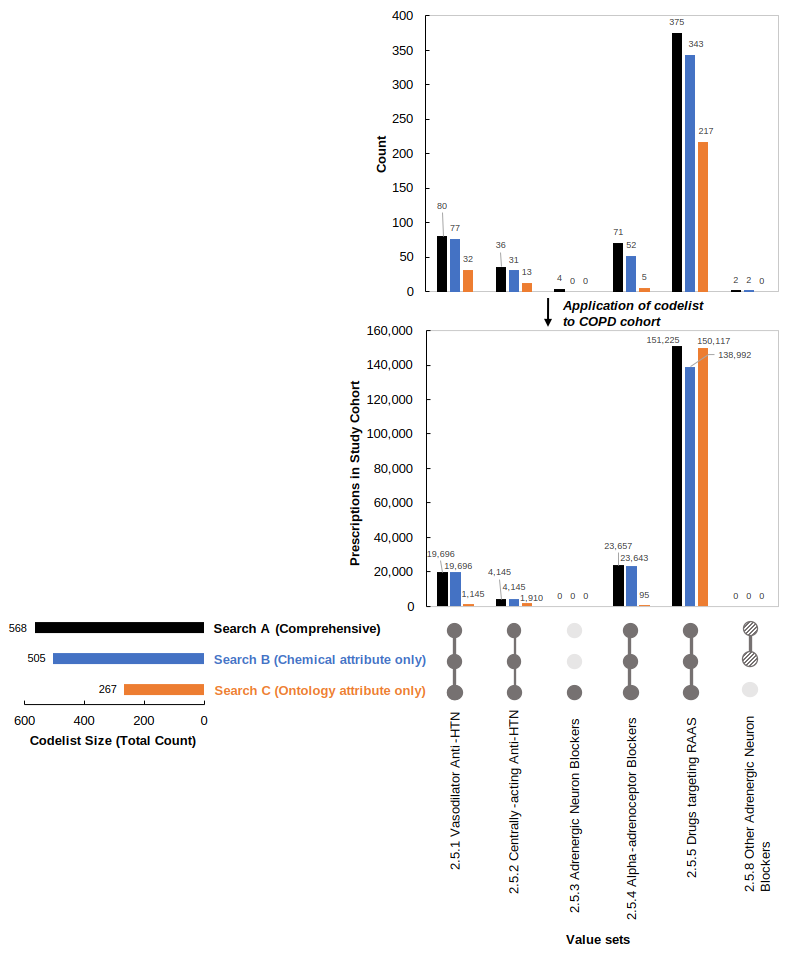

# How to: create drug codelists for recorded prescriptions

This is an extension of [our work to create SNOMED-CT codelists](https://github.com/NHLI-Respiratory-Epi/SNOMED-CT-codelists/tree/main) which adds additional steps to adapt for considerations specific to generating codelists for drugs, instead of for symptoms and conditions.

## Glossary 
<div align="center">
	
| Term | Definition | Example |
| :-- | :-- | :-- |
| Phenotype | Medication which is to be researched | Antihypertensives |
| Ontology | Hierarchical set up of a reference guide | <li>[British National Formulary (BNF)](https://bnf.nice.org.uk/) Chapter 2 for Circulatory System</li><li>[Anatomical Therapeutic Chemical (ATC) Classification System](https://www.who.int/tools/atc-ddd-toolkit/atc-classification): section C for Cardiovascular System  |
| Value set | Subgroups of medications based upon broader code list | <li>BNF Ch 2.5.1 Vasodilator anti-hypertensives</li><li>BNF Ch 2.5.1 Centrally-acting anti-hypertensives</li> |  

</div>

## Creating drug codelists can be broken down in to 7 steps:


At all stages, consider **clinical input**. We have put **✱**  where we believe this to be essential.

## Step 1 : Define purpose and value sets  
- Establish a clinical definition (e.g., drugs for hypertension and heart failure)  **✱**
    - Choose organ system knowing what the drug targets (e.g., circulatory system)    
    - Use this information to select the relevant database’s underlying ontology (e.g., BNF, Ch. 2 circulatory system) and the relevant chapter (e.g., Ch. 2.5 hypertension and heart failure drugs)(or for the ATC: section C: Cardiovascular System)      

        <details><summary><i>User-friendly ontology resources:</i> [Click to expand]</summary>
	
		- BNF: [OpenPrescribing](https://openprescribing.net/bnf/)
    	- ATC: [WHO Collaborating Centre for Drug Statistics Methodology](https://www.whocc.no/atc_ddd_index/)
     	</details>   
- Define value sets (e.g., vasodilator antihypertensives for set 1, centrally-acting antihypertensives for set 2)
- For each value set, collate search terms
  <details><summary><i>Other considerations:</i> [Click to expand]</summary> <i>Name type</i> (chemical, proprietary)&nbsp;&nbsp;&nbsp;&nbsp;<i>Route</i> (oral, injected)&nbsp;&nbsp;&nbsp;&nbsp;<i>Purpose</i> (repository - broad/adaptable across contexts? disease-specific?)&nbsp;&nbsp;&nbsp;&nbsp;<i>Chemistry</i> (don't search on common compounds, active or blocking groups, or side chains such as *-nitrate* *-arginine* *-hydrochloride* *-mesilate*)
  </details>

	<details><summary><i>Put all information of Step 1 into a spreadsheet, so you can refer back to it later:</i> [Click to expand]</summary>

	<p align="center">
		
	</p>

	*This spreadsheet is available for download, called ________in____x folder______.*
	</details>

## Step 2: Conducting search
- Before searching using your collated list, import the database’s drug “dictionary” as a text file.

- **2a) Search database drug dictionary**  
	- **2a(i) chemical + proprietary term search**       (proprietary terms OPTIONAL - database dependent)  
	- **2a(ii) search on underlying ontology**           (step OPTIONAL - database dependent)  
     

- **2b) Tag outstanding codes identified by searching on (ii) underlying ontology; Repeat 2a-2b iteratively**    (OPTIONAL - database dependent)      
    - This checks if you included all possible terms.

        <details><summary><i>How are outstanding codes identified?</i> [Click to expand]</summary>By comparing tags for columns corresponding to Step 2a(i) versus Step 2a(ii). Outstanding codes mean if there is an absence of a Step 2a(i) tag, but presence of a Step2a(ii) tag.
     
     	</details>
     
          
	  	<details><summary><i>So what happens if I get outstanding codes?</i> [Click to expand]</summary>Add additional terms you get to value sets. Re-run steps 2a to 2b (ITERATIVELY - as necessary). Upon multiple iterations, there should be an absence of tags - indicating inclusion of all appropriate terms. (In rare cases in CPRD you'll have outstanding terms left that still show up, that neither fit your value sets nor the ontology, in which case these may be drugs that are miscoded or recently put on the market, perhaps).

  	</details>
        &nbsp;<details><summary><i>Why are Steps 2a(ii) and 2b optional and database-dependent?</i> [Click to expand]</summary>Database might have missing data in search "attribute" variables. For example, in CPRD Aurum, the 2a(i) search attribute variables are <i>termfromemis</i> (i.e., term from EMIS software), <i>productname</i> (containing chemical and proprietary information), <i>drugsubstancename</i> (chemical information/recipe). Ideally if this database didn't have missing data, you would just search on *drugsubstancename* but there is so we search in 2a(i) using all these variables, and perform steps 2a(ii) and 2b.

  	</details>
&nbsp;   


## Step 3: Exclusions
- Manually review each code, one by one
- Exclude by: name, route, formulation (not by product identifier)  
&nbsp;  
	<details><summary><i>Why exclude?</i> [Click to expand]</summary>The broad search may pick up different medications with the same active chemical but of an inappropriate route, i.e., for a different medical indication corresponding to a different organ system (e.g., in a cardiovascular codelist, exclude "ocular" beta-blockers referring to medications given in the eye for glaucoma, instead of medications given by mouth to slow the heart) </details>
 	<details><summary><i>Why not exclude using product identifiers?</i> [Click to expand]</summary>Its a less transparent coding method. Product identifiers are numerical codes that don't contain qualitative information. Unlike excluding by name, route, formulation, exclusions in this way are harder to visualise as one reads through the coding script. Our method is helpful if a researcher were to return to the script, and can easily view and revise exclusions explicitly </details>

  
## Step 4: Cleaning   
- **4a) Remove overlapping codes to make value sets separate**     (OPTIONAL - depends on value sets)     
    - Place temporary tag to identify overlapping codes across multiple value sets. (possible scenario given the broad search)
    - Re-sort to make each set separate (mutually exclusive)
 
      
- **4b) Tag overlapping codes across ontological sections, for clinician and/or epidemiologist**    
    - Place permanent tags on codes for drugs that overlap in other ontology sections  
    - Re-sort to make those sections separate
    - Define chemical suffixes for the tags for efficiency e.g., “*azide*” for diuretics, or “*pril*” for angiotensin-converting enzyme (ACE) inhibitors and angiotensin receptor blockers (ARBs) **✱**       
    - This step helps the codelist stay modifiable, for:
  		<details><summary><i>Analysis stage</i> [Click to expand]</summary>If you have drug covariates, overlaps in class could present collinearity so you may exclude certain drug codes with overlap. (This depends on the size and nature of the codelist itself) </details>
  		<details><summary><i>Adaptation stage</i> [Click to expand]</summary>You might use these tags to adapt your codelist. Maybe you only care about single certain mechanism of action, and/or that drug is contraindicated in your study cohort and it doesn't make sense to include it. </details>         

  
- **4c) Modify value sets as necessary**    (OPTIONAL)  
    - Combine multiple value sets into a broader value set because of:  
      - Study context  
      - Computational considerations (e.g., *Stata* has macro character limits), or
      - You simply change your mind     


## Step 5: Compare to previous codelists or mapping ontologies    
- Version history = Merge together and compare current vs. previous versions
  		<details><summary><i>Why do we care about previous versions?</i> [Click to expand]</summary>Comparison facilitates correct categorization and possible identification of outstanding codes from a previous codelist. </details>
- Mapping = Merge and map codes labelled under different ontologies (e.g., ATC-BNF mapping, ATC-VA_Class mapping).    


*Now we have the “raw” codelist (not study-specific; ready for adaptation to a cohort through clinical review)* 


## Step 6: Send "raw" codelist for clinician to review, to decide study-specific codelist   
- Export codelist as an Excel spreadsheet   
- Ask clinician(s) to review codelist and check codes are appropriate to identify your prescription event of interest (for *your* study context) **✱**   
- Each clinician has their own column headed with their initials, where they label the list of terms for keeping:
<div align="center">

| Value | Label | Definition |
| :-- | :-- | :-- |
| 0 | No | Clear exclusion |
| 1 | Yes | Certainty |
| 2 | Maybe | Uncertainty - use for sensitivity analyses
</div>

- Use multiple clinicians for studies with multimorbidity, resolve discordances between clinicians   (OPTIONAL)    


## Step 7: Keep "master" codelist spreadsheet - with all versions and tags**   
  
- Columns tag codes for different codelist versions:   
    - (i) Raw codes (before clinician review)  
    - (ii) Codes marked by clinician(s) for study codelist (0 no, 1 yes, 2 maybe)  
    - (iii) Codes finalized for study (1s only)  
    - (iv) Tags for overlapping, fixed combination drugs falling into multiple ontology sections (e.g., Ch. 2.5 codelist, but corresponds to Ch. 2.2 and Ch. 2.6 too)    
      &nbsp;


## Example *Stata* code (Steps 2 to 7)   

This code is an example to create a codelist for Chapter 2.5 of the BNF ontology (i.e., [drugs indicated for hypertension and heart failure](https://openprescribing.net/bnf/0205/) )  


```stata
*NB You shouldn't need to change any code within loops, apart from local-macro names, e.g., searchterm, exclude_route, exclude_term, etc.

//*******************************************************************************
//*1) Define purpose and value sets: drug class(es) of interest, collate list of terms for value sets
//*******************************************************************************/

//(spreadsheet as above)

//*******************************************************************************
//*2) Searching CPRD Aurum Product Browser
//*******************************************************************************/

clear all
macro drop _all
set more off 

//Enter directory to save files in
cd "Z:\Group_work\Emily\Product_browsing_study_data\Codelists\Do-files_publication\"
pwd 

local filename "publication_0205HTNandHF_prodbrowsing"

capture log close
log using `filename', text replace

//Directory of product dictionary
local browser_dir "Z:\Database guidelines and info\CPRD\CPRD_CodeBrowser_202202_Aurum"

//Import latest product browser 
import delimited "`browser_dir'/CPRDAurumProduct.txt", stringcols(1 2) //Imports all “attribute” variables searched upon as strings
	*FORCE 'prodcodeid' and 'dmdid' to be string variable, or will lose data
	*Why import variables as strings? When searching you'll use wildcard (*) characters to pick up terms in *any* location 

//no EMIS lookupfile required (unlike medical code browsing)


	
//******
// 2a. (i)Chemical + proprietary name searchterms
//******
	*Insert your search terms into each local as shown below, change local names according to chemical name, then group chemical macros into bnfsubsection macro
	*Put chemical names first, brand names second

*2.5.1 Vasodilator antihypertensive drugs
	*ambrisentan = chemical name, volibris = proprietary/brand name
local ambrisentan_list " "ambrisentan" "volibris" "
local bosentan_list " "bosentan" "stayveer" "tracleer" "
local diazoxide_list " "diazoxide" "proglycem" "eudemine" "
local hydralazine_list " "hydralazine" "apresoline" "
local iloprost_list " "iloprost" "ilomedin" "ventavis" "
local macitentan_list " "macitentan" "opsumit" "
local minoxidil_list " "minoxidil" "loniten" "
local riociguat_list " "riociguat" "adempas" "
local sildenafil_list " "sildenafil" "granpidam" "revatio" "
local sitaxentan_list " "sitaxentan" "
local tadalafil_list " "tadalafil" "adcirca" "
local vericiguat_list " "vericiguat" "verquvo" "

local vasodil20501 " "ambrisentan_list" "bosentan_list" "diazoxide_list" "hydralazine_list" "iloprost_list" "macitentan_list" "minoxidil_list" "riociguat_list" "sildenafil_list" "sitaxentan_list" "tadalafil_list" "vericiguat_list" "

	
*2.5.2 Centrally-acting antihypertensive drugs
local clonidine_list " "clonidine"  "catapres" "
local guanfacine_list " "guanfacine" "tenex" "
local methyldopa_list " "methyldopa" "aldomet" "
local moxonidine_list " "moxonidine" "physiotens" "

local centact20502 " "clonidine_list" "guanfacine_list" "methyldopa_list" "moxonidine_list" "
	
*2.5.3 Adrenergic neurone blocking drugs	
local guanethidine_monosulfate_list " "guanethidine"  "ismelin" "

local adrblocker20503 " "guanethidine_monosulfate_list" "


*2.5.4: Alpha-adrenoceptor blocking drugs
local doxazosin_mesilate_list " "doxazosin"  "cardura" "doxadura" "larbex" "raporsin" "slocinx" "
local indoramin_list " "indoramin" "baratol" "doralese" "
local phenoxybenzamine_list " "phenoxybenzamine" "dibenyline" "
local phentolamine_mesilate_list " "phentolamine" "rogitine" "
local prazosin_list " "prazosin" "hypovase" "minipress"  "
local terazosin_list " "terazosin" "benph" "hytrin" "

local ablocker20504 " "doxazosin_mesilate_list" "indoramin_list" "phenoxybenzamine_list" "phentolamine_mesilate_list" "prazosin_list" "terazosin_list" "

*2.5.5: RAAS - no overlap 
local aliskiren_list " "aliskiren"  "rasilez" "
local azilsartan_medoxomil_list " "azilsartan" "edarbi" "
local candesartan_cilexetil_list " "candesartan" "amias" "
local cilazapril_list " "cilazapril" "vascace" "
local eprosartan_list " "eprosartan" "teveten" "
local fosinopril_list " "fosinopril" "
local imidapril_list " "imidapril" "tanatril" "
local moexipril_list " "moexipril" "perdix" "
*2.5.5: RAAS - overlap - diuretics, CCB
local captopril_list " "captopril" "kaplon" "ecopace" "noyada" "zidocapt" "capozide" "acezide" "capoten" "tensopril" "acepril" " // co-zidocapt - don't use dash
local enalapril_list " "enalapril" "innovace" "pralenal" "innozide" "
local irbesartan_list " "irbesartan" "aprovel" "ifirmasta" "coaprovel" "
local lisinopril_list " "lisinopril" "lisicostad" "carace" "zestril" "lisopress" "zestoretic" "
local losartan_list " "losartan" "cozaar" "
local olmesartan_medoxomil_list " "olmesartan" "olmetec" "sevikar" "

local perindopril_list " "perindopril" "coversyl" "
local quinapril_list " "quinapril" "accupro" "quinil" "accuretic" "
local ramipril_list " "ramipril"  "tritace" "lopace" "triapin" "
local telmisartan_list " "telmisartan"  "micardis" "tolura" "tolucombi" "
local trandolapril_list " "trandolapril" "gopten" "odrik" "tarka" "
local valsartan_list " "valsartan" "diovan" "entresto" "

local RAASnooverlap20505 " "aliskiren_list" "azilsartan_medoxomil_list" "candesartan_cilexetil_list" "cilazapril_list" "eprosartan_list" "fosinopril_list" "imidapril_list" "moexipril_list" "

local RAAS1overlap20505 " "captopril_list" "enalapril_list" "irbesartan_list" "lisinopril_list" "losartan_list" "olmesartan_medoxomil_list" "

local RAAS2overlap20505 " "perindopril_list" "quinapril_list" "ramipril_list" "telmisartan_list" "trandolapril_list" "valsartan_list" "

	*need to break up into multiple macros
	*if Stata is used, for primary subsections that exceed the programming software's character limit for information contained within nested macros, subsections may need to be temporarily split (e.g., 2.5.5 drugs for Renin-angiotensin system).  

*2.5.8 Other adrenergic neurone blocking drugs 
local ketanserin_list " "ketanserin" "ketensin" "

local othadrblocker20508 " "ketanserin_list" "


*check macro data successfully stored
	display `vasodil20501'
	display `centact20502'
	display `adrblocker20503'
	display `ablocker20504'
	display `RAASnooverlap20505'
	display `RAAS1overlap20505'
	display `RAAS2overlap20505'
	display `othadrblocker20508'

	
*Search all search terms in descriptions

foreach searchterm in ///
"vasodil20501" "centact20502" "adrblocker20503" "ablocker20504" "RAASnooverlap20505" "RAAS1overlap20505" "RAAS2overlap20505" "othadrblocker20508" { 
	
    display "Making a column called `searchterm'"
	generate byte `searchterm' = 0
	
	foreach chemterm in ``searchterm'' {
	
		display "Checking individual search terms in: `chemterm'"
		
		foreach indiv in ``chemterm'' {
		
			display "Searching all columns for *`indiv'*"
		
			foreach codeterm in lower(term) lower(productname) lower(drugsubstancename) {
			
				display "`searchterm': Checking `codeterm' column for *`indiv'*"
				replace `searchterm' = 1 if strmatch(`codeterm', lower("*`indiv'*"))
			}
		}
	}
}
*ensure dictionary terms passed through a `lower()` function to avoid missing matches due to differing case 
*brand/proprietary terms OPTIONAL - database dependent - if you have complete data on drugsubstancename, then you only need to search on drugsubstancename  

******
// 2a(ii)separate BNF search 
******
*helps pick up outstanding brand or chem names
*can't include in above - nested macros don't like astricks (***)

generate byte 	step2aii_bnfsearch205=.
replace 		step2aii_bnfsearch205=1 if 	strmatch(bnfchapter,"205*")  | ///
							strmatch(bnfchapter,"*/ 205*")  

*keep found terms for (2ai) (2aii)
generate byte step2ai_chem_brand_term = .
replace step2ai_chem_brand_term=1 if vasodil20501==1 | centact20502==1 | adrblocker20503==1 | ablocker20504==1 | RAASnooverlap20505==1 | RAAS1overlap20505==1 | RAAS2overlap20505==1 | othadrblocker20508==1

count if step2ai_chem_brand_term == 1 	// 617 from (2a,i)
count if step2aii_bnfsearch205	 == 1		// 281 from (2a,ii)

keep if step2ai_chem_brand_term == 1 | step2aii_bnfsearch205==1  // 627 from (2a i and ii together)

compress
count // 627 total  (2a i and ii together)
browse


******
//2b. Did BNF search pick up *outstanding / additional* codes(proprietary or chemical names) not initially searched on in (2ai)?
******

generate byte 	step2b_BNFoutstanding=.
replace 		step2b_BNFoutstanding=1 if step2ai_chem_brand_term!=1 & step2aii_bnfsearch205==1
label define lab1 1 "outstanding from 2aii BNFsearch"
label values 	step2b_BNFoutstanding lab1 

codebook 	step2b_BNFoutstanding
list 	if step2b_BNFoutstanding==1
browse 	if step2b_BNFoutstanding==1  
count 	if step2b_BNFoutstanding==1   // 10 outstanding codes 
	*10 not part of initial value sets = 9 Selexipag & 1 Na-Nitroprusside. Rare? Not commonly prescribed? wait for clinician review.

compress
count // 627 
*if pick up new brand names, return to step 2ai and add in outstanding brand names for the iteration/rerun of code
*then run this step again
*may not have any/very few step2b_BNFoutstanding=1 if your search is sensitive/broad enough and you went thru iterations of adding outstanding search terms

*here, of the step2b_BNFoutstanding=1, few drug issues...new drug? (if all clearly not part of value set, exclude. Otherwise wait for clinician.)


*change 0 in chem_brand_term to . - easier to visualise which codes picked up
replace vasodil20501=. if vasodil20501==0
replace centact20502=. if centact20502==0
replace adrblocker20503=. if adrblocker20503==0
replace ablocker20504=. if ablocker20504==0
replace RAASnooverlap20505=. if RAASnooverlap20505==0
replace RAAS1overlap20505=. if RAAS1overlap20505==0
replace RAAS2overlap20505=. if RAAS2overlap20505==0
replace othadrblocker20508=. if othadrblocker20508==0

sort vasodil20501 centact20502 adrblocker20503 ablocker20504 RAASnooverlap20505 RAAS1overlap20505 RAAS2overlap20505 othadrblocker20508 termfromemis 

*************************************************************
//3.) Remove any irrelevant codes
*************************************************************

*exclude by outstanding codes - N/A
	*only if all not part of chemical value set. (step may not be indicated in all codelists)
	*here N/A keep for clinician review
	
*exclude ROUTE 
preserve // this code here gives you a list of the routes 
keep route
duplicates drop
list route
restore

local exclude_route " "*ocular*" "*intracavernous*" "*cutaneous*" " 

//search for route-codes to exclude
foreach excludeterm in exclude_route {

	generate byte `excludeterm' = .

	foreach codeterm in lower(route) {
		
		foreach searchterm in ``excludeterm'' {		
			
			replace `excludeterm' = 1 if strmatch(`codeterm', "`searchterm'")
		}
	}
}

list term prodcodeid drugsubstancename route if exclude_route == 1	
		count if exclude_route == 1 

		drop if exclude_route == 1 // 20 deleted based on route
		drop exclude_route 

		count // 607 new total
		compress

		browse
		sort termfromemis 
		
*exclude TERM, DRUGSUBSTANCENAME 
		*although previously excluded on 'ocular' route, route has missing data for what we want to exclude, so also exclude based on term 'eye'
local exclude_term_drugsub " "*eye*" "*gluten*" " 

//search for route-codes to exclude
foreach excludeterm in exclude_term_drugsub {

	generate byte `excludeterm' = .

	foreach codeterm in lower(term) lower(drugsubstancename) {
		
		foreach searchterm in ``excludeterm'' {		
			
			replace `excludeterm' = 1 if strmatch(`codeterm', "`searchterm'")
		}
	}
}

list term prodcodeid drugsubstancename route if exclude_term_drugsub == 1
count if exclude_term_drugsub == 1 

drop if exclude_term_drugsub == 1 // 6 deleted based on term & drugsubstancename
drop exclude_term_drugsub 

count // 601 new total
compress

browse
sort termfromemis 

/*exclude PRODCODEID / template - but not a transparent method, not recommended
local exclude_prodcodeid "XXXXXXXX"

//search for prodcodeid-codes to exclude
foreach excludeterm in exclude_prodcodeid {

	generate byte `excludeterm' = .

	foreach codeterm in lower(prodcodeid) {
		
		foreach searchterm in ``excludeterm'' {		
			
			replace `excludeterm' = 1 if strmatch(`codeterm', "`searchterm'")
		}
	}
}

list term prodcodeid if exclude_prodcodeid == 1
count if exclude_prodcodeid == 1

drop if exclude_prodcodeid == 1
drop exclude_prodcodeid

count 
compress

browse
sort termfromemis
*/

*exclude by FORMULATION - N/A

*exclude by BNFCHAPTER - not recommended since very incomplete data

*Why don't exclude by PRODUCT IDENTIFIER? (i.e., prodcodeid in CPRD)
/*Why? It is a less transparent coding method. As product identifiers are
numerical codes that do not contain qualitative information (eg, name, route, formulation),
the exclusions are harder to visualise as one read through the coding script.
This is important partiicularly when a researcher were to return to the script,
e.g., to revise the nature of the codelist exclusions, and visualise these exclusions explicity. */

*************************************************************
//4.) Cleaning / resorting
*************************************************************

******
//4a. flag the codes in multiple BNF subsections / overlap/not mutually exclusive - that should NOT be + make mutually exclusive
******
*this may be more important for chapters with subsections that may have overlap in resulting found terms, if your search is specific/broad enough (e.g., in Ch. 2.2 Diuretics, searching just on "furosemide" would lead to found terms in both 2.2.2 and 2.2.4 and 2.2.8, that should not be )

generate flag_overlap=.
egen rowtotal = rowtotal(vasodil20501 centact20502 adrblocker20503 ablocker20504 RAASnooverlap20505 RAAS1overlap20505 RAAS2overlap20505 othadrblocker20508)
replace flag_overlap=1 if rowtotal>1
drop rowtotal

sort flag_overlap drugsubstancename termfromemis
count if flag_overlap==1 // none (0)
*count if flag_overlap==1 & drugsubstancename!=""
*br if flag_overlap==1 

compress
count // 601
browse

*make not mutually exclusive - resort based on missing & complete data on drug substance name
	*N/A for this codelist

******
//4b. Flag codes in multiple BNF subsections, that SHOULD be - for clinician & covariate analysis
******

	*flagging 0202 diuretics
	generate byte step4b_also_0202_diuretic=.
	replace step4b_also_0202_diuretic=1 if strmatch(lower(term),"*azide*") 
	replace step4b_also_0202_diuretic=1 if strmatch(lower(drugsubstancename),"*azide*") 
	replace step4b_also_0202_diuretic=1 if strmatch(lower(term),"*pamide*") 
	replace step4b_also_0202_diuretic=1 if strmatch(lower(drugsubstancename),"*pamide*")
	count if step4b_also_0202_diuretic==1 	// 66 codes with ingredients also Ch. 2.2 diuretic

	*flagging 0206 Ca2+ channel blockers
	generate byte step4b_also_0206_CCB=.
	replace step4b_also_0206_CCB=1 if strmatch(lower(term),"*triapin*")  
	replace step4b_also_0206_CCB=1 if strmatch(lower(drugsubstancename),"*dipine*") 
	replace step4b_also_0206_CCB=1 if strmatch(lower(term),"*dipine*")  
	replace step4b_also_0206_CCB=1 if strmatch(lower(drugsubstancename),"*pamil*") 
	replace step4b_also_0206_CCB=1 if strmatch(lower(term),"*pamil*") 
	count if step4b_also_0206_CCB==1 		// 28 codes with ingredients also Ch. 2.6 CCB

******		
//4c. Modify value sets, as necessary
******

generate byte RAAS20505=.
replace RAAS20505=1 if RAASnooverlap20505==1
replace RAAS20505=1 if RAAS1overlap20505==1
replace RAAS20505=1 if RAAS2overlap20505==1

replace RAAS20505=0 if RAASnooverlap20505==0
replace RAAS20505=0 if RAAS1overlap20505==0
replace RAAS20505=0 if RAAS2overlap20505==0
drop RAASnooverlap20505 RAAS1overlap20505 RAAS2overlap20505


	
	
*************************************************************
//5.) Compare to previous lists or ontology mapping 
*************************************************************
	*as necessary / if available
	*e.g., codelist from previous CPRD Aurum version


	
*************************************************************
*Final order, export for clinician review, generate study-specific codelist, tag file

//6) Send raw codelist for clinician review - for study-specific codelist
//7) Keep 'master' codelist with all versions & tags
*************************************************************

//order
order prodcodeid termfromemis productname dmdid formulation routeofadministration drugsubstancename substancestrength bnfchapter drugissues ///
vasodil20501 centact20502 adrblocker20503 ablocker20504 RAAS20505 othadrblocker20508  step2ai_chem_brand_term step2aii_bnfsearch205 step2b_BNFoutstanding ///
step4b_also_0202_diuretic step4b_also_0206_CCB  

sort vasodil20501 centact20502 adrblocker20503 ablocker20504 RAAS20505 othadrblocker20508 termfromemis 

drop flag_overlap 

count // 601 total  - pre-clinician review

//export (v0 no clinician, raw)
compress
save `filename', replace
export excel using `filename'.xlsx, firstrow(variables) replace
//export delimited `filename'.csv, quote replace

/*example versions:
v0 = Raw codelist 
v1 = Clinician1 1/2/0s
v2 = Clinician2 1/2/0s, without Clinician1's 0s)
v3 = Clinician1 & Clinician2's 1/2/0s merged (i.e., v0-v3 merged)
v4 = Final, project-specific Codelist- discordancies resolved, final project-specific list

keep v0 raw, v3 merged, and v4 project-specific

*/


//Generate tag file for codelist repository

//= Update details here, everything else is automated ==========================
local description "0205 BNF HTNandHF RX"
local author "ELG"
local date "February 2023"
local code_type "prod browsing"
local database "CPRD Aurum"
local database_version "February 2022"
local keywords "BNF2.5 hypertension, heart failure, vasodilators, antihypertensives, alpha-blockers, renin-angiotensin system"
local notes "Codelist based on BNF Ch. 2.5 Hypertension & Heart Failure, value sets organised by BNF subsection (2.5.1...2.5.8). Use individual subsections to adapt codelist prn based on study context. https://openprescribing.net/bnf/0205/. Clinician 1s are for [x study]. "
local date_clinician_approved "February 2023"
//==============================================================================

clear
generate v1 = ""
set obs 9

replace v1 = "`description'" in 1
replace v1 = "`author'" in 2
replace v1 = "`date'" in 3
replace v1 = "`code_type'" in 4
replace v1 = "`database'" in 5
replace v1 = "`database_version'" in 6
replace v1 = "`keywords'" in 7
replace v1 = "`notes'" in 8
replace v1 = "`date_clinician_approved'" in 9

export delimited "`filename'.tag", replace novarnames delimiter(tab)

use "`filename'", clear  //so that you can see results of search after do file run

log close
```  

^ That was our search method simulated in CPRD Aurum for Ch. 2.5 codelist. We'll call this comprehensive method **Search A**.  

In CPRD Aurum, because there's missing data in the drug dictionary...  

Here is what happens if you were to carry out a **Search B** based on just chemical attribute variable only (i.e., *drugsubstance* name in CPRD Aurum) or a **Search C** based on just ontology attribute variable only (i.e., *bnfchapter* in CPRD Aurum), 
and applied the codelist to a sample cohort to find prescriptions:  

<p align="center">
	
</p>

Notice sometimes the search type matters (codes are missed); sometimes it doesn't matter (not many codes missed).  
But you **cannot predict** how well a restricted search (e.g., B or C) is going to perform.     
We recommend Search A - the comprehensive one.    


## Pre-print
Graul EL, Stone PW, Massen GM, Hatam S, Adamson A, Denaxas S, Peters NS, Quint, JK. Determining prescriptions in electronic healthcare record (EHR) data: methods for development of standardized, reproducible drug codelists. medRxiv [Internet] 2023; Available from: https://doi.org/10.1101/2023.04.14.23287661
